# Масштабирование приложений - Отчет

**Автор:** Зиганшин Станислав

## Содержание
1. [Docker Registry for Linux Part 1](#1-docker-registry-for-linux-part-1)
2. [Docker Registry for Linux Parts 2 & 3 (Аутентификация)](#2-docker-registry-for-linux-parts-2--3-аутентификация)
3. [Docker Orchestration Hands-on Lab](#3-docker-orchestration-hands-on-lab)
4. [Swarm Stack Introduction](#4-swarm-stack-introduction)
5. [Кластеризованное приложение-счетчик](#5-кластеризованное-приложение-счетчик)
6. [Сравнение Docker Swarm и Kubernetes](#6-сравнение-docker-swarm-и-kubernetes)

---

## 1. Docker Registry for Linux Part 1

### Выполненные шаги

1. Запуск registry контейнера:
```bash
docker run -d -p 5000:5000 --name registry registry:2
```

2. Pull, tag и push образа hello-world:
```bash
docker pull hello-world
docker tag hello-world localhost:5000/hello-world
docker push localhost:5000/hello-world
```

3. Запуск registry с внешним хранилищем:
```bash
mkdir -p /mnt/registry

docker run -d -p 5000:5000 \
  --name registry \
  -v /mnt/registry:/var/lib/registry \
  registry:2
```

### Скриншот содержимого registry

После публикации образа hello-world, содержимое директории `/mnt/registry`:

```bash
find /mnt/registry -type d
```

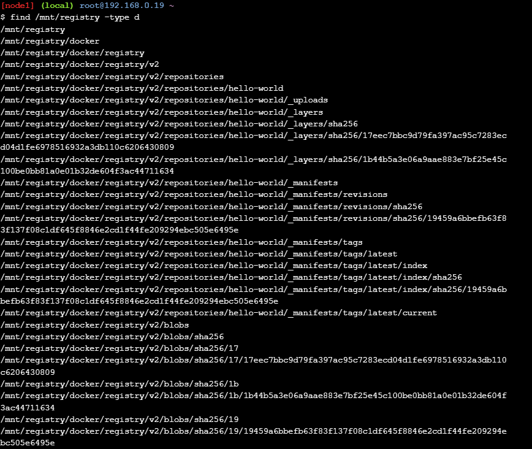

---

## 2. Docker Registry for Linux Parts 2 & 3 (Аутентификация)

### Настройка HTTPS и аутентификации

1. Создание самоподписанного сертификата:
```bash
mkdir -p /root/certs /root/auth

openssl req -newkey rsa:4096 -nodes -sha256 \
  -keyout /root/certs/domain.key \
  -x509 -days 365 \
  -out /root/certs/domain.crt \
  -subj "/CN=localhost"
```

2. Создание файла паролей (htpasswd):
```bash
docker run --rm --entrypoint htpasswd \
  httpd:2 -Bbn testuser testpassword > /root/auth/htpasswd
```

3. Запуск registry с TLS и аутентификацией:
```bash
docker run -d -p 5000:5000 --name registry \
  -v /root/certs:/certs \
  -v /root/auth:/auth \
  -e REGISTRY_HTTP_TLS_CERTIFICATE=/certs/domain.crt \
  -e REGISTRY_HTTP_TLS_KEY=/certs/domain.key \
  -e REGISTRY_AUTH=htpasswd \
  -e "REGISTRY_AUTH_HTPASSWD_REALM=Registry Realm" \
  -e REGISTRY_AUTH_HTPASSWD_PATH=/auth/htpasswd \
  registry:2
```

### Демонстрация HTTPS подключения

Проверка что registry работает по HTTPS (без аутентификации возвращает UNAUTHORIZED):

```bash
curl -k https://localhost:5000/v2/
```


### Демонстрация аутентификации

**Неуспешная аутентификация** (неправильные учетные данные):

```bash
curl -k -u wronguser:wrongpassword https://localhost:5000/v2/_catalog
```

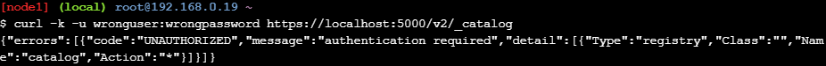

**Успешная аутентификация** (правильные учетные данные):

```bash
curl -k -u testuser:testpassword https://localhost:5000/v2/_catalog
```

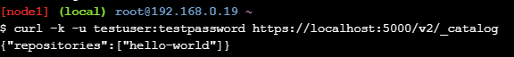

---

## 3. Docker Orchestration Hands-on Lab

### Инициализация Swarm кластера

```bash
# На manager ноде
docker swarm init --advertise-addr eth0

# На worker нодах
docker swarm join --token SWMTKN-1-xxx... <MANAGER-IP>:2377
```

### Ноды в режиме Active

Все три ноды Active, готовы принимать задачи:

```bash
docker node ls
```

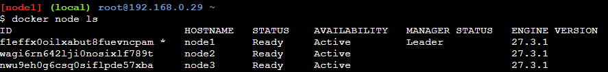

Создание сервиса с 6 репликами и проверка распределения по нодам:

```bash
docker service create --name myservice --replicas 6 nginx:alpine
docker service ps myservice
```

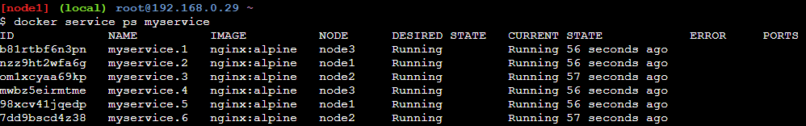

### Ноды в режиме Drain

Переводим node2 в Drain:

```bash
docker node update --availability drain node2
docker node ls
```

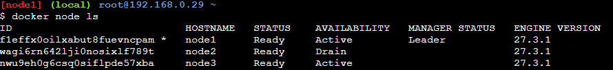

После перевода в Drain задачи с node2 переместились на другие ноды:

```bash
docker service ps myservice
```

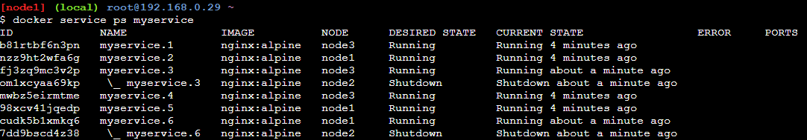

**При переводе в Drain:**
- Все задачи (контейнеры) на этой ноде останавливаются
- Задачи перемещаются на другие Active ноды
- Новые задачи не планируются на эту ноду

### Восстановление узла в состояние Active

```bash
docker node update --availability active node2
docker node ls
```

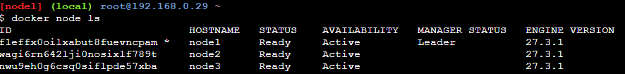

Проверка сервиса после восстановления ноды:

```bash
docker service ps myservice
```

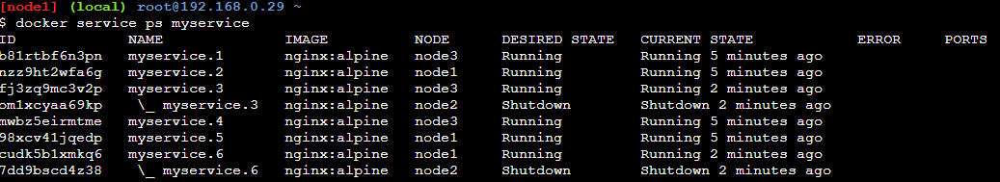

### Ответы на вопросы

**Вопрос: Восстановилась ли работа запущенного сервиса на этом узле?**

**Ответ:** Нет, автоматически работа сервиса на узле **НЕ восстанавливается**. После возвращения узла в состояние Active, на нем не появляются контейнеры автоматически. Swarm не перебалансирует задачи между нодами автоматически - он только гарантирует, что нужное количество реплик запущено где-то в кластере.

**Вопрос: Что необходимо сделать, чтобы запустить работу службы на этом узле снова?**

**Ответ:** Есть несколько способов:

1. **Принудительное обновление сервиса** (рекомендуется):
```bash
docker service update --force myservice
```
Это заставит Swarm перераспределить задачи, и некоторые из них будут запланированы на восстановленный узел.

2. **Масштабирование сервиса**:
```bash
docker service scale myservice=0
docker service scale myservice=6
```

3. **Удаление и повторное создание сервиса**.

---

## 4. Swarm Stack Introduction

### Как задать количество реплик

Реплики задаются в `deploy` -> `replicas`:

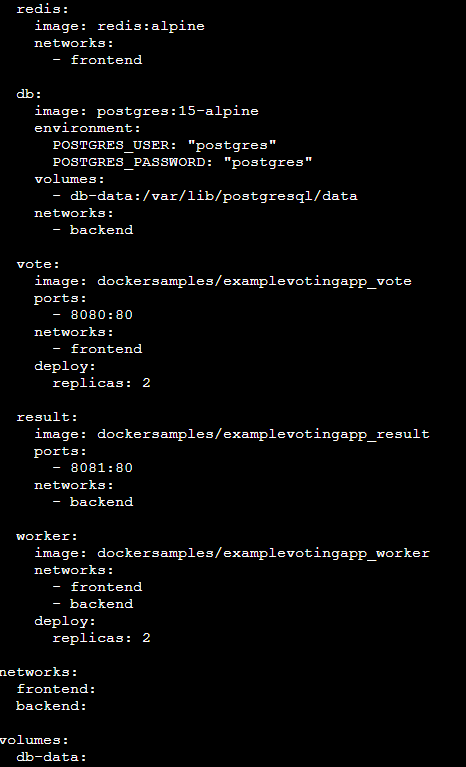

```yaml
services:
  vote:
    image: dockersamples/examplevotingapp_vote
    deploy:
      replicas: 2    # <-- Количество инстансов сервиса
```

### Деплой стека и проверка сервисов

```bash
docker stack deploy -c docker-stack.yml vote
docker stack services vote
```

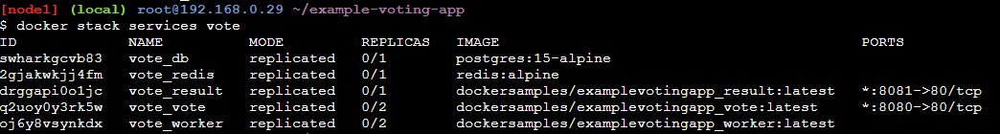

Распределение задач по нодам:

```bash
docker service ps vote_vote
docker service ps vote_worker
```

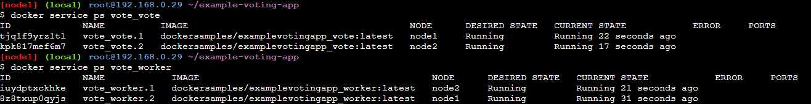

### Проверка жизнеспособности сервисов (Healthcheck)

Проверка статуса контейнеров:

```bash
docker ps --format "table {{.Names}}\t{{.Status}}"
```

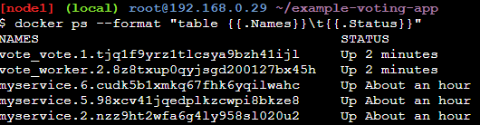

В docker-compose.yml жизнеспособность сервисов проверяется через секцию `healthcheck`:

```yaml
services:
  redis:
    image: redis:alpine
    healthcheck:
      # Команда проверки здоровья (код 0 = healthy)
      test: ["CMD", "redis-cli", "ping"]
      # Интервал между проверками
      interval: 5s
      # Таймаут одной проверки
      timeout: 3s
      # Количество неудачных проверок до пометки unhealthy
      retries: 3
      # Время ожидания перед началом проверок
      start_period: 10s
```

Docker периодически выполняет команду `test`. Если код возврата 0 - контейнер healthy, иначе unhealthy. После нескольких неудачных проверок (retries) Swarm перезапустит контейнер.

### Масштабирование на лету

```bash
docker service scale vote_vote=5
```

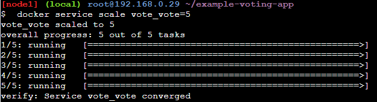

Проверка после масштабирования:

```bash
docker service ps vote_vote
```

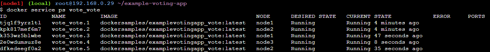

---

## 5. Кластеризованное приложение-счетчик

### Структура проекта

```
scaling-app/
├── app/
│   ├── app.py           # Flask приложение
│   ├── Dockerfile       # Образ для Flask
│   └── requirements.txt # Python зависимости
├── kubernetes/
│   └── deployment.yaml  # Манифесты для k3s
├── docker-compose.yml        # Базовый compose (без Swarm)
├── docker-compose.swarm.yml  # Compose для Swarm с 4 репликами
├── load_test.py              # Скрипт нагрузочного тестирования
└── README.md                 # Этот отчет
```

### Запуск в Docker Swarm

```bash
# 1. Инициализация Swarm
docker swarm init

# 2. Сборка образа
docker build -t counter-app ./app

# 3. Деплой стека с 4 репликами Flask
docker stack deploy -c docker-compose.swarm.yml counter-stack

# 4. Проверка статуса
docker service ls
docker service ps counter-stack_web
```

### Нагрузочное тестирование

**Запуск тестирования:**
```bash
pip install aiohttp

# Тест с 1 репликой
docker service scale counter-stack_web=1
python load_test.py --url http://localhost:5000 --requests 1000 --concurrency 50

# Тест с 4 репликами
docker service scale counter-stack_web=4
python load_test.py --url http://localhost:5000 --requests 1000 --concurrency 50
```

**Результаты тестирования (1000 запросов, 50 параллельных):**

| Метрика | 1 реплика | 4 реплики | Улучшение |
|---------|-----------|-----------|-----------|
| **RPS (запросов/сек)** | 49.27 | 277.14 | **+462%** (в 5.6 раз) |
| **Среднее время ответа** | 987.71 ms | 163.76 ms | **-83%** (в 6 раз быстрее) |
| **Медиана** | 984.13 ms | 113.35 ms | **-88%** |
| **P99 время ответа** | 1901.12 ms | 404.45 ms | **-79%** |
| **Общее время теста** | 20.30 сек | 3.61 сек | **-82%** |

**Результат теста с 1 репликой:**
```
============================================================
TEST RESULTS
============================================================
[STATS]
   Successful requests: 1000
   Failed requests: 0
   Total time: 20.30 seconds
   Requests per second (RPS): 49.27

[RESPONSE TIME (ms)]
   Min: 55.80
   Max: 2088.53
   Avg: 987.71
   Median: 984.13

[HOST DISTRIBUTION (load balancing)]
   bb4e508385aa: 1000 (100.0%) ####################
```

**Результат теста с 4 репликами:**
```
============================================================
TEST RESULTS
============================================================
[STATS]
   Successful requests: 1000
   Failed requests: 0
   Total time: 3.61 seconds
   Requests per second (RPS): 277.14

[RESPONSE TIME (ms)]
   Min: 4.01
   Max: 591.13
   Avg: 163.76
   Median: 113.35

[HOST DISTRIBUTION (load balancing)]
   751da184997a: 267 (26.7%) #####
   7a7ab1b2e97a: 263 (26.3%) #####
   bb4e508385aa: 242 (24.2%) ####
   07ee9d86445c: 228 (22.8%) ####
```

С 4 репликами RPS вырос в 5.6 раз, время ответа упало в 6 раз. Балансировка работает - запросы распределяются примерно поровну между инстансами.

### Репликация сервиса с БД

**Вопрос: Существуют ли какие-то особенности при работе реплицированного сервиса с БД?**

**Ответ:** Да, с БД всё сложнее чем с приложением:

- **Консистентность** - если писать в разные реплики, данные могут конфликтовать. Возможна потеря данных и split-brain при разделении сети.
- **State** - БД хранит данные на диске, нужен общий storage или репликация на уровне самой БД.
- **Порядок операций** - транзакции должны идти в правильном порядке, обычно нужна Master-Slave архитектура.

**Как решать:**

**Для Redis:**
```yaml
# Использовать Redis Sentinel или Redis Cluster
services:
  redis-master:
    image: redis:7-alpine
    command: redis-server --appendonly yes

  redis-slave:
    image: redis:7-alpine
    command: redis-server --replicaof redis-master 6379
    deploy:
      replicas: 2
```

**Для PostgreSQL:**
```yaml
# Использовать PostgreSQL с потоковой репликацией
# Или managed решения: Patroni, Stolon, PgPool
services:
  postgres-primary:
    image: postgres:15
    environment:
      POSTGRES_REPLICATION_MODE: master

  postgres-replica:
    image: postgres:15
    environment:
      POSTGRES_REPLICATION_MODE: slave
      POSTGRES_MASTER_HOST: postgres-primary
    deploy:
      replicas: 2
```

В этом проекте используется простой подход - одна реплика Redis, а масштабируется только приложение. Для продакшена можно взять managed БД (AWS RDS, Cloud SQL) или NewSQL типа CockroachDB.

---

## 6. Сравнение Docker Swarm и Kubernetes

### Основные отличия

| Аспект | Docker Swarm | Kubernetes |
|--------|--------------|------------|
| Сложность | Простой, быстрый старт | Сложнее, больше концепций |
| Масштабируемость | До сотен нод | До тысяч нод |
| Конфигурация | docker-compose.yml | YAML манифесты (много файлов) |
| Автоскейлинг | Только ручной | HPA (автоматический) |
| Проверки здоровья | healthcheck | liveness, readiness, startup probes |
| Сети | overlay | CNI plugins (более гибкие) |
| Хранилища | volumes | PV, PVC, StorageClass |
| Балансировка | Встроенный routing mesh | Ingress Controllers |

### Конфигурационный файл для k3s

Полный манифест находится в `kubernetes/deployment.yaml`.

Разница в синтаксисе:

**Swarm:**
```yaml
services:
  web:
    image: counter-app:latest
    deploy:
      replicas: 4
    healthcheck:
      test: ["CMD", "curl", "-f", "http://localhost:5000/health"]
      interval: 30s
```

**Kubernetes:**
```yaml
apiVersion: apps/v1
kind: Deployment
metadata:
  name: web
spec:
  replicas: 4
  template:
    spec:
      containers:
        - name: web
          image: counter-app:latest
          livenessProbe:
            httpGet:
              path: /health
              port: 5000
            periodSeconds: 30
```

### Что есть в Kubernetes, чего нет в Swarm

- **HPA** - автоскейлинг по CPU/Memory (в Swarm только руками)
- **Три типа проб** - liveness, readiness, startup (в Swarm только healthcheck)
- **Namespaces** - изоляция ресурсов между проектами
- **RBAC** - нормальное управление доступом
- **CRD** - можно добавлять свои типы ресурсов
- Большая экосистема: Helm, Operators, Service Mesh

### Запуск в k3s

```bash
# Установка k3s
curl -sfL https://get.k3s.io | sh -

# Применение манифестов
kubectl apply -f kubernetes/

# Проверка
kubectl get pods -n counter-app
kubectl get services -n counter-app

# Масштабирование
kubectl scale deployment web --replicas=8 -n counter-app

# Автоскейлинг (если включен metrics-server)
kubectl get hpa -n counter-app
```

---

## Заключение

Что сделано:
- Docker Registry с внешним хранилищем, HTTPS и аутентификацией
- Swarm кластер, разобрались с Active/Drain состояниями
- Стеки и healthcheck
- Приложение-счетчик с 4 репликами Flask
- Нагрузочное тестирование
- Конфигурация для Kubernetes (k3s)

По итогу: Flask масштабируется легко, с БД сложнее. Swarm проще для старта, Kubernetes мощнее но требует больше времени на настройку. При 4 репликах получили прирост производительности в **5.6 раз**.
